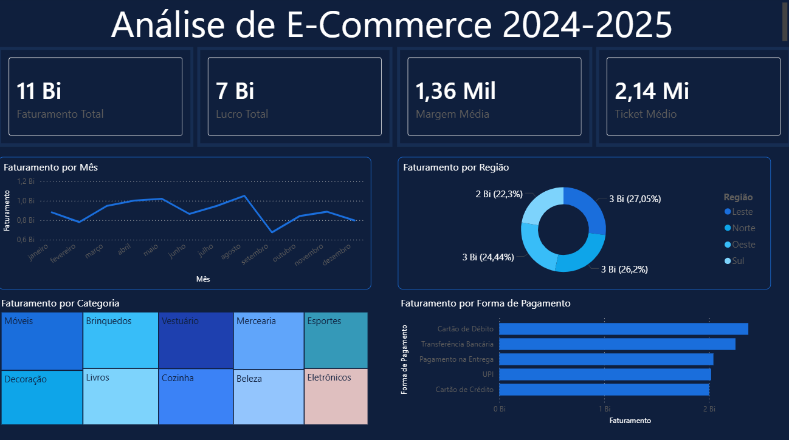
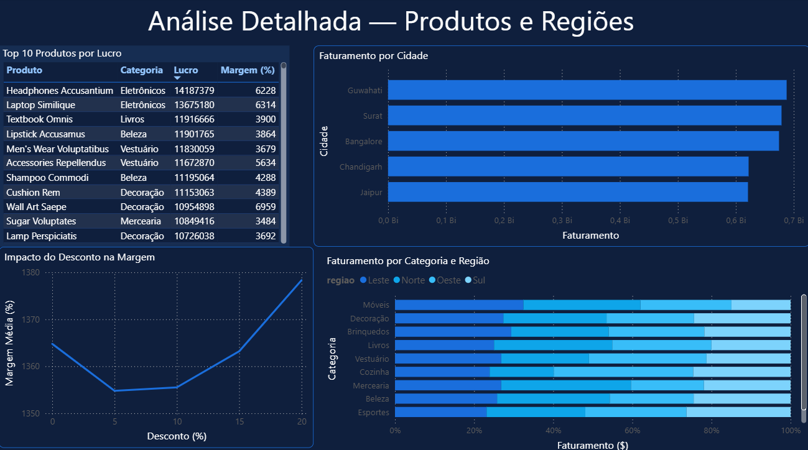

# Análise de E-Commerce 2024-2025

Dashboard de análise de dados de e-commerce utilizando Python, SQL e Power BI.

---

## Sobre o projeto

Dataset com 5.000 registros de vendas de uma loja online cobrindo o período de 2024 a 2025, obtido no [Kaggle](https://www.kaggle.com/datasets/prince7489/e-commerce-sales). A análise cobre faturamento, lucro, categorias, regiões, produtos e formas de pagamento.

---

## Perguntas respondidas

- Qual o faturamento total e o lucro gerado?
- Qual categoria de produto mais fatura?
- Qual região tem maior receita?
- Qual mês teve maior faturamento?
- Quais são os 10 produtos mais lucrativos?
- Qual forma de pagamento é mais utilizada?
- O desconto impacta a margem de lucro?
- Quais são as 5 cidades com maior faturamento?

---

## Ferramentas

---

## Etapas do projeto

**1. Python** — limpeza e tratamento dos dados
- Tradução das colunas e valores para português
- Conversão de tipos de dados
- Criação de colunas auxiliares (ano, mês, margem)

**2. SQL** — análise exploratória
- Visão geral do negócio (faturamento, lucro, margem, ticket médio)
- Análise por categoria, região e cidade
- Análise temporal por mês e ano
- Top 10 produtos mais vendidos e mais lucrativos
- Impacto do desconto na margem de lucro

**3. Power BI** — dashboard interativo com 2 páginas

---

## Dashboard

---

## Principais insights

- **Faturamento total** de R$ 11 Bi com margem média de 14,92%
- **Home Decor** é a categoria com maior faturamento
- **Norte** é a região líder em receita com 27,05% do total
- **Maio de 2025** foi o mês de maior faturamento
- **Headphones Accusantium** é o produto mais lucrativo
- As formas de pagamento são bem distribuídas, sem dominância de nenhuma
- O desconto não impacta significativamente a margem de lucro
